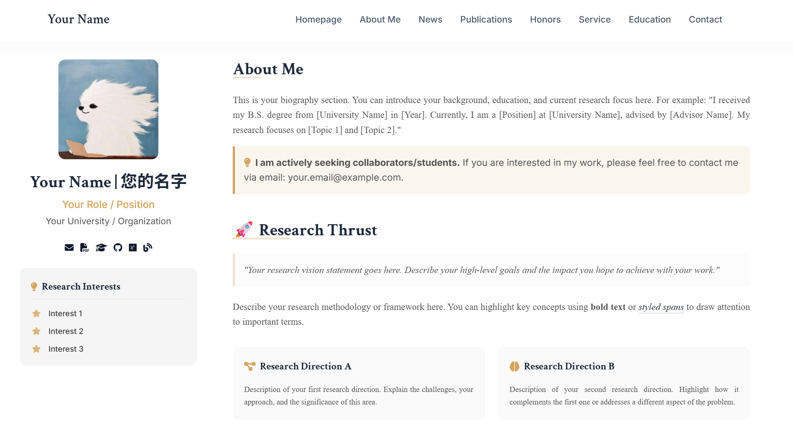
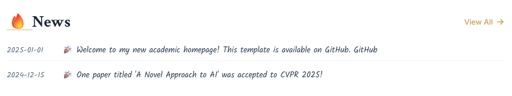
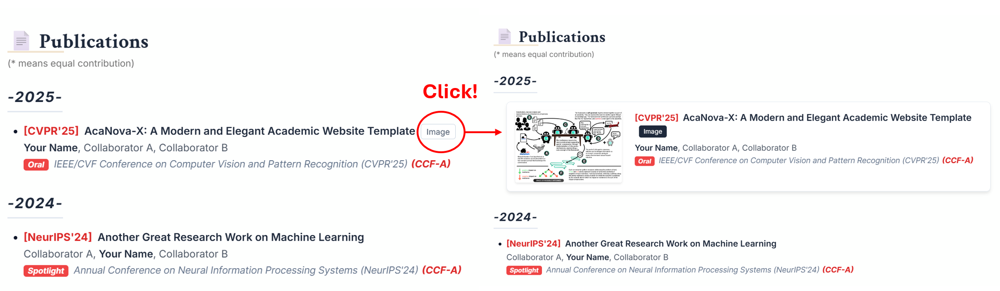
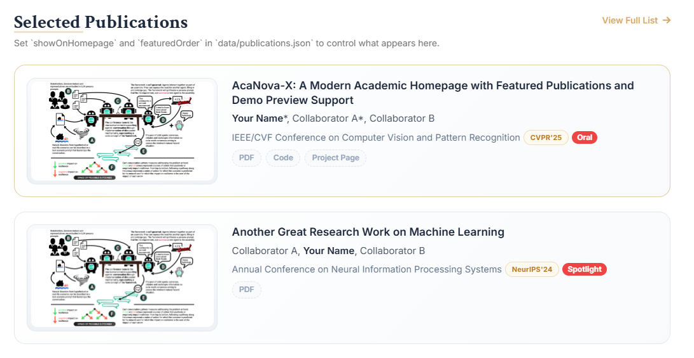

# AcaNova-X: The Next-Gen Academic Homepage Template

<div align="center">

[](https://opensource.org/licenses/MIT)


</div>

Modern academic homepage template with a two-column landing page, JSON-driven content, selected publication cards, and an expanded publications page with optional demo preview support.

## Introduction

> **AcaNova-X** represents a fusion of **Academic** rigor and the brilliance of a **Nova**. The suffix **-X** symbolizes the unknown variables in research, the infinite possibilities, and the "X-factor" that makes each academic journey unique.

Born from the need for a balanced academic web presence, **AcaNova-X** aims to be neither too cluttered nor too plain. It keeps the original `1.0.0` spirit of a clean and easy-to-maintain academic homepage, while `1.1.0` extends that foundation with stronger publication showcase, richer previews, and more reusable template defaults.

## Version Preview

### Version 1.1.0

<details>
  <summary>Show preview</summary>
  <p align="center">
    
  </p>
</details>

Latest version preview with selected publications, expanded publication cards, and updated documentation. The GIF is intentionally shown in a smaller, collapsible format to keep the README easier to scan.

### Version 1.0.0

<details>
  <summary>Show preview</summary>
  <p align="center">
    
  </p>
</details>

Original template preview retained for reference, so users can compare the earlier default presentation with the newer release.

## Latest Version

Current release: `version 1.1.0`

## Features

- Clean homepage layout with sticky profile card and modular sections
- `news.json`, `honors.json`, and `publications.json` as the main editable data sources
- Selected publications on the homepage controlled by `showOnHomepage` and `featuredOrder`
- All publications page with built-in filters for `all`, `first-author`, and `accepted`
- Default expanded publication cards with thumbnail preview
- Automatic `demo.gif` loading when it exists beside a paper thumbnail

## What's New in 1.1.0

- Adds homepage selected publications controlled by `showOnHomepage` and `featuredOrder`
- Upgrades the publications page to default expanded cards instead of the previous compact layout
- Adds built-in publication filters for all papers, first-author papers, and accepted papers
- Adds automatic `demo.gif` preview loading with fallback to the static thumbnail
- Keeps PDF, Code, and Project Page buttons visible in the template, even when placeholder links are still `"#"`
- Adjusts the default publication thumbnail box to a flatter horizontal preview ratio
- Updates the README preview assets from the old single `example.gif` naming to versioned files

## 1.0.0 Baseline

The original `1.0.0` version still represents the base spirit of AcaNova-X:

- A clean and lightweight academic homepage template
- JSON-driven content editing for news, honors, and publications
- Easy deployment for personal academic websites
- A simpler publication presentation style for users who prefer a minimal starting point

## Detailed Section Walkthrough

### Part 1. Structured Profile and Research Vision

<p align="center">
  
</p>

- Highlights a researcher profile, collaboration note, and research directions in a balanced landing page layout
- Guides visitors from a broad research vision to more concrete thrusts and interests
- Preserves one of the most useful ideas from the original template: a homepage that feels complete without becoming crowded

### Part 2. Dynamic News with a Human Touch

<p align="center">
  
</p>

- Keeps news content lightweight and editable through JSON
- Preserves the more personal, update-oriented visual tone introduced in the original template
- Works well for recent awards, paper acceptances, project launches, and lab updates

### Part 3. Publication Showcase

#### Version 1.0.0

<p align="center">
  
</p>

- `1.0.0` focuses on a simpler publication presentation with a cleaner starting point
- Suitable for users who want a lighter publication section and prefer to expand features gradually

#### Version 1.1.0

<p align="center">
  
</p>

- `1.1.0` upgrades the publication section into a more presentation-oriented showcase
- Adds selected publications on the homepage, expanded cards, media preview support, and clearer action buttons
- Makes the difference from `1.0.0` explicit by turning publications into one of the main visual highlights of the template

#### Part 3 Comparison

- `1.0.0`: simpler publication listing and lighter default presentation
- `1.1.0`: featured homepage papers, expanded publication cards, filterable full list, and `demo.gif` preview fallback
- This is the most visible functional difference between the two versions

### Part 4. Professional Structure for Academic Use

<p align="center">
  
</p>

- Keeps honors, service, education, and contact information organized in a clean academic profile flow
- Works well as a practical template for personal websites, lab pages, and early-career academic portfolios
- Retains the original goal of being polished enough for public use while staying easy to customize

## Version History

### version 1.1.0

- Syncs the template with the latest website behavior and presentation style
- Introduces demo preview support for publication cards
- Introduces selected publications on the homepage
- Improves the all-publications page with filtering and expanded presentation
- Refines template defaults and documentation for easier reuse

### version 1.0.0

- Original base template release
- Includes the initial homepage, data files, and documentation assets

## Quick Start

1. Replace `assets/profile.jpg` with your own portrait.
2. Edit the placeholder text in `index.html`.
3. Update `data/news.json`, `data/honors.json`, and `data/publications.json`.
4. Put publication images under `assets/publications/<paper-folder>/`.
5. Open `index.html` locally or deploy the folder to GitHub Pages.

## Publication Data

Each publication entry supports the following commonly used fields:

```json
{
  "title": "Paper Title",
  "displayTitle": "Optional alternate title shown on the homepage",
  "authors": "<strong>Your Name</strong>, Coauthor A, Coauthor B",
  "type": "accepted",
  "isFirstAuthor": true,
  "showOnHomepage": true,
  "featuredOrder": 1,
  "venue": "CVPR 2025",
  "year": "2025",
  "highlight": "(Oral)",
  "thumbnail": "assets/publications/paper-name/paper-thumb.png",
  "tags": [
    { "text": "Paper", "link": "https://arxiv.org/abs/xxxx.xxxxx" },
    { "text": "Code", "link": "https://github.com/your-repo" }
  ]
}
```

## Demo Preview

To enable animated preview for a paper card, place a `demo.gif` in the same folder as the thumbnail:

```text
assets/publications/paper-name/
  demo.gif
  paper-thumb.png
```

The template tries to load `demo.gif` first and falls back to the static thumbnail automatically.

## Pages

- `index.html`: homepage
- `pages/all-publications.html`: full publications list with filters
- `pages/all-news.html`: full news list
- `pages/all-honors.html`: full honors list

## Notes

- The template uses Tailwind CDN plus a small custom stylesheet in `styles.css`.
- Relative asset paths in JSON are handled automatically for subpages under `pages/`.
- README previews now use `docs/version_1.0.0.gif` and `docs/version_1.1.0.gif`.
- The darker look in a GIF preview usually comes from the GIF export itself rather than GitHub Markdown rendering. The README now reduces the preview size to make the page easier to scan, but if needed, the source GIF can be re-exported later with a brighter palette.
